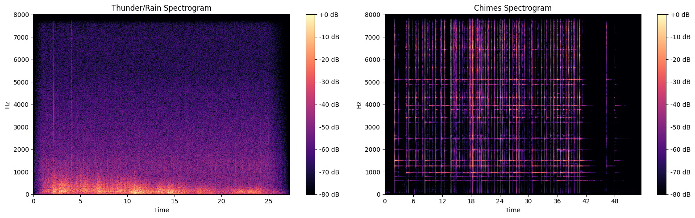

# Chapter 1: Working with Audio Data

<p class="hero-subtitle">
Following the <a href="https://huggingface.co/learn/audio-course/en/chapter1/introduction">Hugging Face Audio Course, Unit 1</a>, but instead of speech I'm using soundscapes. Two sounds from the Free to Use Sounds library: <strong>thunder/rain/cicadas</strong> recorded in Ubud, Indonesia, and <strong>musical chimes</strong> recorded in Georgia. These have very different spectral signatures and that's what makes them fun to compare.
</p>

📓 **[Full notebook on GitHub](https://github.com/my-sonicase/learn-gen-AI-audio/blob/main/notebooks/chapter1_audio_fundamentals.ipynb)**

---

## The sounds

Two files, two very different worlds. Thunder is broadband noise, energy smeared everywhere. Chimes are tonal, with clear harmonic peaks. Before we even plot anything, just listen.

### Original vs 16 kHz

The originals were recorded at 96 kHz (thunder) and 192 kHz (chimes). For the blog I've converted them to 48 kHz MP3, which is still way more than what ML models need. We resample to 16 kHz because that's what most audio models expect (Whisper, Wav2Vec2, etc). Listen to both and see if you can hear the difference:

**🌧️ Thunder / Rain / Cicadas, Ubud, Indonesia**

Original (48 kHz MP3):
<audio controls>
  <source src="audio/thunder_original.mp3" type="audio/mpeg">
</audio>

Resampled (16 kHz):
<audio controls>
  <source src="audio/thunder_16khz.mp3" type="audio/mpeg">
  <source src="audio/thunder_16khz.wav" type="audio/wav">
</audio>

**🔔 Musical Chimes, Georgia**

Original (48 kHz MP3):
<audio controls>
  <source src="audio/chimes_original.mp3" type="audio/mpeg">
</audio>

Resampled (16 kHz):
<audio controls>
  <source src="audio/chimes_16khz.mp3" type="audio/mpeg">
  <source src="audio/chimes_16khz.wav" type="audio/wav">
</audio>

The 16 kHz versions sound a bit duller, especially in the high end. The chimes lose some of their shimmer. But for an ML model doing classification? More than enough information.

---

## Loading and inspecting

```python
import librosa

# Load at native sample rate first
thunder_native, sr_thunder = librosa.load("thunder.wav", sr=None, mono=True)
chimes_native, sr_chimes = librosa.load("chimes.wav", sr=None, mono=True)

# Then resample to 16 kHz for ML
SR = 16000
thunder = librosa.resample(thunder_original, orig_sr=sr_thunder, target_sr=SR)
chimes = librosa.resample(chimes_original, orig_sr=sr_chimes, target_sr=SR)
```

A few things about the raw files. 96 kHz and 192 kHz sample rates, stereo channels, PCM_24 and FLOAT encodings. These come from a professional sound library. `librosa.load()` handles all the conversion: mixes to mono, resamples, normalizes to float32. One line and you're done.

### What is sampling rate, really?

The sampling rate is how many times per second the continuous sound wave was measured. At 96,000 Hz, we captured 96,000 snapshots per second. The Nyquist theorem says this lets us faithfully represent frequencies up to half the sampling rate (48 kHz for 96 kHz SR). Human hearing tops out at ~20 kHz, so 96 kHz is overkill for most purposes. For ML models, 16 kHz is standard, enough to capture everything below 8 kHz.

---

## Waveforms: the time domain

A waveform shows amplitude over time. Each point is one sample. It tells you *when* things happen and how loud they are, but nothing about *which frequencies* are present.

```python
fig, axes = plt.subplots(2, 1, figsize=(14, 6))
librosa.display.waveshow(thunder, sr=SR, ax=axes[0], color='steelblue')
librosa.display.waveshow(chimes, sr=SR, ax=axes[1], color='coral')
```


Thunder/rain has relatively constant amplitude with occasional spikes (thunder claps, heavy drips). The rain creates a continuous "bed" of sound. Chimes show clear attacks when each chime is struck, followed by decay as the tone fades out. The silence between strikes is visible. Already very different, but the waveform doesn't tell us what frequencies make up each sound.

---

## Frequency spectrum (FFT)

The Discrete Fourier Transform converts a signal from time domain to frequency domain. It answers: which frequencies are present, and how strong are they? We use the FFT (Fast Fourier Transform), which is just an efficient algorithm for computing the DFT. We take a short window of each sound (4096 samples ≈ 0.25s at 16 kHz) and look at its spectrum.

```python
def plot_spectrum(signal, sr, title, color='steelblue', n_fft=4096):
    chunk = signal[:n_fft]
    window = np.hanning(n_fft)  # smooths edges, avoids spectral leakage
    spectrum = np.abs(np.fft.rfft(chunk * window))
    freqs = np.fft.rfftfreq(n_fft, 1/sr)
    plt.plot(freqs, 20 * np.log10(spectrum + 1e-10), color=color, linewidth=0.5)
```


Thunder/rain: energy spread across many frequencies. This is what "broadband noise" looks like. Rain is essentially random fluctuations across the whole spectrum. Chimes: distinct peaks at specific frequencies, the fundamentals and harmonics of each chime. This is why frequency analysis is powerful. Two sounds that look similar as waveforms become clearly distinguishable in the frequency domain.

But there's a problem: the FFT gives us frequencies for one fixed window of time. What if we want to see how frequencies change over time?

---

## Spectrogram (STFT)

A spectrogram is what you get when you compute many FFTs on overlapping windows across the whole signal, then stack them side by side. X axis is time, Y axis is frequency, color is amplitude. The algorithm is called the Short Time Fourier Transform (STFT).

```python
D = librosa.stft(signal)
S_db = librosa.amplitude_to_db(np.abs(D), ref=np.max)
librosa.display.specshow(S_db, sr=SR, x_axis='time', y_axis='hz')
```



Now we can see time AND frequency together. Thunder/rain: energy smeared across all frequencies over time, with bright vertical bands where thunder claps happen (sudden broadband energy). Chimes: horizontal lines (sustained tones at specific frequencies) that appear when a chime is struck and fade out. This is why spectrograms are the go to input for many audio ML models. They're basically "images" of sound.

---

## Mel spectrogram

This is what most ML models actually use. Whisper takes a log mel spectrogram as input. The idea: our ears don't perceive frequencies linearly. The difference between 100 Hz and 200 Hz sounds huge, but 8000 Hz vs 8100 Hz is barely noticeable. The mel scale warps the frequency axis to match human perception: more resolution at low frequencies, less at high frequencies.

```python
S = librosa.feature.melspectrogram(y=signal, sr=SR, n_mels=128, fmax=8000)
S_db = librosa.power_to_db(S, ref=np.max)
librosa.display.specshow(S_db, sr=SR, x_axis='time', y_axis='mel', fmax=8000)
```


The lower frequencies get more vertical space, which is where a lot of the interesting information lives.

| Representation | X axis | Y axis | Shows | Used for |
|---|---|---|---|---|
| Waveform | Time | Amplitude | When things happen | Quick inspection, editing |
| FFT Spectrum | Frequency | Amplitude | What frequencies exist | Single point analysis |
| Spectrogram | Time | Frequency (linear) | Frequencies over time | Visualization, analysis |
| Mel Spectrogram | Time | Frequency (mel scale) | Perceptually weighted frequencies | **ML model input** |

---

## All four views together

Here's everything side by side for each sound. Waveform, FFT spectrum, spectrogram, mel spectrogram.


---

## ESC 50: an environmental sound dataset

The HF course uses MINDS 14 (a speech dataset). Since we're doing soundscapes, I use **ESC 50** instead: 2,000 clips, 5 seconds each, 50 classes of environmental sounds. All originally from Freesound.org.

```python
from datasets import load_dataset

dataset = load_dataset("ashraq/esc50", split="train")
```

### All 50 categories

| | | | | |
|---|---|---|---|---|
| airplane | breathing | brushing_teeth | can_opening | car_horn |
| cat | chainsaw | chirping_birds | church_bells | clapping |
| clock_alarm | clock_tick | coughing | cow | crackling_fire |
| crickets | crow | crying_baby | dog | door_wood_creaks |
| door_wood_knock | drinking_sipping | engine | fireworks | footsteps |
| frog | glass_breaking | hand_saw | helicopter | hen |
| insects | keyboard_typing | laughing | mouse_click | pig |
| pouring_water | **rain** | rooster | **sea_waves** | sheep |
| siren | sneezing | snoring | **thunderstorm** | toilet_flush |
| train | vacuum_cleaner | washing_machine | water_drops | **wind** |

The bold ones are the categories closest to our own sounds. Let's listen to a few:

**🌧️ Rain (ESC 50)**
<audio controls>
  <source src="audio/esc50_rain.mp3" type="audio/mpeg">
  <source src="audio/esc50_rain.wav" type="audio/wav">
</audio>

**⛈️ Thunderstorm (ESC 50)**
<audio controls>
  <source src="audio/esc50_thunderstorm.mp3" type="audio/mpeg">
  <source src="audio/esc50_thunderstorm.wav" type="audio/wav">
</audio>

**🌊 Sea Waves (ESC 50)**
<audio controls>
  <source src="audio/esc50_sea_waves.mp3" type="audio/mpeg">
  <source src="audio/esc50_sea_waves.wav" type="audio/wav">
</audio>

**🔔 Church Bells (ESC 50)**
<audio controls>
  <source src="audio/esc50_church_bells.mp3" type="audio/mpeg">
  <source src="audio/esc50_church_bells.wav" type="audio/wav">
</audio>

**💨 Wind (ESC 50)**
<audio controls>
  <source src="audio/esc50_wind.mp3" type="audio/mpeg">
  <source src="audio/esc50_wind.wav" type="audio/wav">
</audio>

### ESC 50 rain vs our thunder recording

How does a 5 second ESC 50 rain clip compare to our own 27 second field recording? Let's look at the mel spectrograms side by side:


---

## Preprocessing: resampling with cast_column

ESC 50 audio is at 44.1 kHz. Most models expect 16 kHz. Instead of downloading and resampling manually, HF Datasets can resample on the fly:

```python
from datasets import Audio

dataset_16k = dataset.cast_column("audio", Audio(sampling_rate=16000))
```

`cast_column` doesn't resample everything at once. It happens only when you access each example. Important for large datasets where you don't want to process millions of files upfront.

---

## Feature extraction with Whisper

ML models don't accept raw audio arrays. They need input features, typically a log mel spectrogram with specific parameters. Each model has its own feature extractor that knows exactly how to transform the audio. Whisper expects 30 second chunks (padded if shorter), 80 mel bins, 16 kHz sample rate.

```python
from transformers import WhisperFeatureExtractor

feature_extractor = WhisperFeatureExtractor.from_pretrained("openai/whisper-small")
inputs = feature_extractor(thunder, sampling_rate=SR, return_tensors="np")
# Shape: (1, 80, 3000) → batch=1, mel_bins=80, time_frames=3000
```

This is literally what Whisper "sees":


80 mel bins, 3000 time frames (30 seconds). Shorter audio is zero padded on the right. You can apply this to a whole dataset with `map`:

```python
def prepare_dataset(example):
    audio = example["audio"]
    features = feature_extractor(
        audio["array"],
        sampling_rate=audio["sampling_rate"],
        padding=True
    )
    return features

dataset_processed = dataset_16k.map(prepare_dataset)
```

For models like Whisper that handle both audio input and text output, HF provides an `AutoProcessor` that bundles the feature extractor with a tokenizer:

```python
from transformers import AutoProcessor

processor = AutoProcessor.from_pretrained("openai/whisper-small")
# processor.feature_extractor → WhisperFeatureExtractor
# processor.tokenizer → WhisperTokenizer
```

---

## Streaming

Audio datasets can be enormous. GigaSpeech is over 1 TB. Streaming mode loads examples one at a time, on the fly, no disk space needed. The trade off: you can't index by position (`dataset[42]`), you can only iterate.

```python
esc50_stream = load_dataset("ashraq/esc50", split="train", streaming=True)

# Can't do esc50_stream[0], must iterate
first = next(iter(esc50_stream))

# take() grabs the first N examples
for example in esc50_stream.take(5):
    print(example['category'], example['audio']['sampling_rate'])

# Resample streamed data on the fly too
esc50_stream_16k = esc50_stream.cast_column("audio", Audio(sampling_rate=16000))
```

| Situation | Use streaming? |
|---|---|
| Dataset fits on disk, you'll reuse it | ❌ Download once |
| Dataset is huge (100+ GB) | ✅ Stream |
| Quick experiment, just need a few examples | ✅ Stream |
| Evaluating on many datasets sequentially | ✅ Stream |

For ESC 50 (~600 MB), streaming is optional. For AudioSet (~2M clips), it's essential.

---

## What I learned

The key insight from comparing thunder/rain and chimes: they look very different in the frequency domain. Broadband noise vs clear tonal peaks. This is exactly what ML models exploit for classification. The mel spectrogram is the most common input representation because it captures frequency information on a perceptually meaningful scale.

The whole pipeline goes: raw audio → resample to 16 kHz → feature extractor → log mel spectrogram → model. Understanding each step makes everything that comes next in the course make more sense.

📓 **[Full notebook with all the code](https://github.com/my-sonicase/learn-gen-AI-audio/blob/main/notebooks/chapter1_audio_fundamentals.ipynb)**
