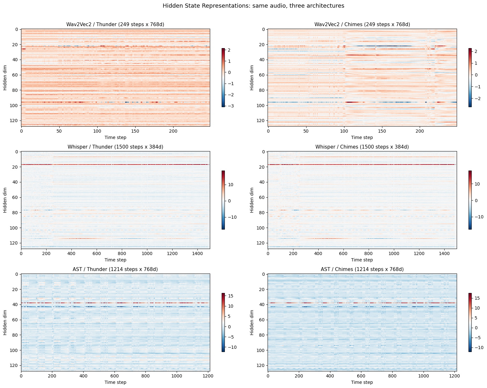
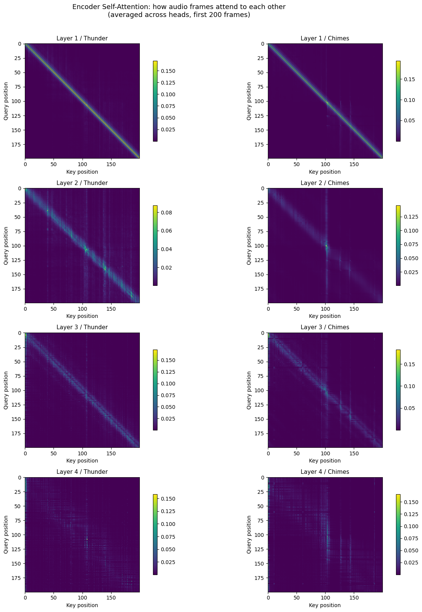
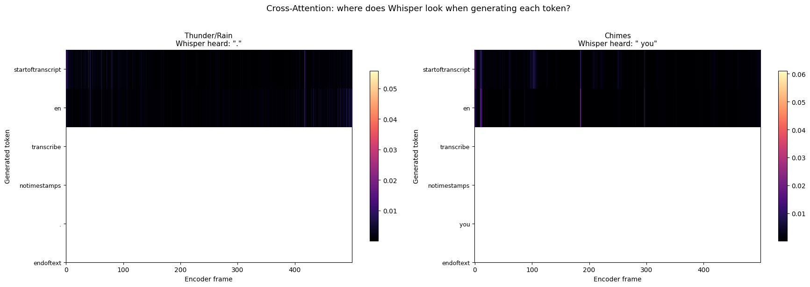
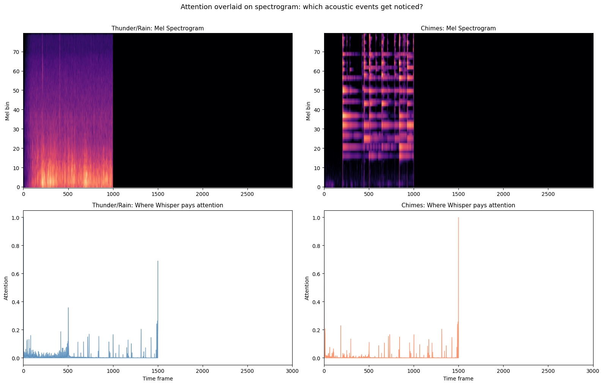

# Chapter 3: Inside Audio Transformers

<p class="hero-subtitle">
Following the <a href="https://huggingface.co/learn/audio-course/en/chapter3/introduction">Hugging Face Audio Course, Unit 3</a>. The course chapter is pure theory: CTC vs Seq2Seq, encoder only vs encoder decoder, how audio enters a transformer. All essential, but no code. This notebook makes it tangible. We load Wav2Vec2, Whisper, and AST side by side, trace the data flow through each, and visualize the attention patterns on our thunder and chimes recordings.
</p>

📓 **[Full notebook on GitHub](https://github.com/my-sonicase/learn-gen-AI-audio/blob/main/notebooks/chapter3_inside_audio_transformers.ipynb)**

---

## Part 1: Three Architectures, One Audio Clip

The HF course describes three architecture families for audio:

| Architecture | Type | Input | Example | Used for |
|---|---|---|---|---|
| CTC | Encoder only | Raw waveform | Wav2Vec2 | ASR (speech to characters) |
| Seq2Seq | Encoder decoder | Mel spectrogram | Whisper | ASR, captioning, translation |
| Classification | Encoder only | Spectrogram patches | AST | Audio classification |

We load all three and feed them the same 5 second clips of thunder and chimes.

```python
from transformers import (
    Wav2Vec2Model, Wav2Vec2FeatureExtractor,
    WhisperModel, WhisperFeatureExtractor,
    ASTModel, AutoFeatureExtractor,
)

w2v_model = Wav2Vec2Model.from_pretrained("facebook/wav2vec2-base", attn_implementation="eager")
whisper_model = WhisperModel.from_pretrained("openai/whisper-tiny", attn_implementation="eager")
ast_model = ASTModel.from_pretrained("MIT/ast-finetuned-audioset-10-10-0.4593", attn_implementation="eager")
```

We need `attn_implementation="eager"` to extract attention weights. The default `"sdpa"` is faster but doesn't support `output_attentions=True`.

### Parameter counts

| Model | Parameters | Type | Encoder layers | Decoder layers |
|---|---|---|---|---|
| Wav2Vec2 base | 94.4M | Encoder only | 12 | n/a |
| Whisper tiny | 37.8M | Encoder decoder | 4 | 4 |
| AST | 86.2M | Encoder only | n/a (ViT) | n/a |

### How each model sees the same audio

Each model preprocesses audio completely differently:

| Model | Input format | Shape (5s clip) |
|---|---|---|
| Wav2Vec2 | Raw waveform | (1, 80000) |
| Whisper | Mel spectrogram | (1, 80, 3000) |
| AST | Spectrogram patches | (1, 1024, 128) |

Wav2Vec2 eats the raw samples directly. Whisper converts to a mel spectrogram first. AST chops the spectrogram into patches like a Vision Transformer. Same audio, three completely different representations before the model even starts.

### What comes out: hidden states

| Model | Output shape | Meaning |
|---|---|---|
| Wav2Vec2 | (1, 249, 768) | 249 time steps × 768d, one vector per ~20ms |
| Whisper | (1, 1500, 384) | 1500 time steps × 384d, the decoder cross attends to this |
| AST | (1, 1214, 768) | 1214 patches × 768d, pooled for classification |

### Hidden states as heatmaps

Thunder vs chimes, across all three architectures. We're looking at the first 128 dimensions of each model's output:



Each model creates a completely different representation of the same audio. Wav2Vec2 is fine grained with many time steps, learned directly from the raw waveform. Whisper has coarser time resolution, derived from the mel spectrogram. AST is patch based, like a vision transformer looking at the spectrogram as an image. And the same model produces visibly different patterns for thunder vs chimes.

---

## Part 2: Inside Whisper, Encoder vs Decoder

Whisper is the most interesting to explore because it has both an encoder and a decoder. The full data flow:

```
Raw audio (80,000 samples)
  → Mel spectrogram (1, 80, 3000)  ← always padded to 30s
    → Encoder → (1, 1500, 384)     ← 3000 frames / 2 from conv layers
      → Decoder cross-attends to encoder output
        → generates tokens one at a time
```

```python
print("Whisper-tiny architecture:")
# Encoder: 4 layers, 6 heads, 384d
# Decoder: 4 layers, 6 heads, 384d
# Vocab size: 51865
# Max source positions: 1500 (= 30s of audio)
# Max target positions: 448 (= max tokens to generate)
```

The encoder compresses 3000 mel frames down to 1500 time steps via two convolutional layers (stride 2). Each output step is a 384 dimensional vector representing about 20ms of audio. The decoder then cross attends to these 1500 encoder states when generating each output token.

---

## Part 3: Visualizing Attention

This is the payoff. Two types of attention to look at: encoder self attention (how the model connects different parts of the audio) and cross attention (how the decoder "looks at" the audio when generating each token).

### Encoder self attention

We extract attention from all 4 encoder layers and visualize the first 200 time steps (~2.6 seconds):



The pattern is clear: early layers attend mostly locally (the bright diagonal), while deeper layers develop broader, more global attention patterns. This makes sense. Low level features like frequency content are local, but higher level concepts like "this is rain" or "this is a chime strike" require connecting distant parts of the signal.

### Individual attention heads

Each head in the last encoder layer learns a different pattern:


Some heads focus on local context (sharp diagonal), others attend broadly. Some seem to specialize in periodic patterns. This is the model distributing different aspects of audio understanding across its heads.

### Cross attention: where the decoder looks

When Whisper tries to "transcribe" our environmental sounds (it's a speech model, so it doesn't know what to do with rain and chimes), the cross attention shows where the decoder looks in the audio for each generated token.

```python
thunder_ca, thunder_tokens, thunder_text = get_cross_attention(thunder_10s)
chimes_ca, chimes_tokens, chimes_text = get_cross_attention(chimes_10s)

# Thunder: Whisper heard '.'
# Chimes: Whisper heard ' you'
```

Whisper generates almost nothing for both clips, just a period for thunder and "you" for chimes. It's a speech model confronted with non speech audio. But the cross attention is still revealing:



Even when Whisper has nothing meaningful to transcribe, the attention tells us which parts of the audio the model found "interesting." The special tokens (startoftranscript, en, transcribe, notimestamps) each attend to different parts of the audio as the model tries to figure out what it's hearing.

### Attention over the spectrogram

Here we overlay the total cross attention on top of the mel spectrogram for each sound:



Thunder/rain has continuous energy spread across the clip, so attention is distributed broadly. Chimes have distinct transient events, and the attention profile reflects this. Whisper is a speech model trying to process environmental sounds, but the attention patterns still tell us what the model finds acoustically salient.

---

## What I learned

| What we explored | What we learned |
|---|---|
| 3 architectures (Wav2Vec2, Whisper, AST) | Same audio, completely different representations |
| Input formats | Raw waveform vs mel spectrogram vs spectrogram patches |
| Encoder self attention | Early layers = local, deeper layers = global |
| Attention heads | Each head specializes in a different pattern |
| Cross attention | Where the decoder "looks" when generating each token |
| Attention + spectrogram | Links attention to actual acoustic events |

The big takeaway: these models build up increasingly abstract representations of audio through their layers. The attention visualizations make the theory from the HF course concrete. You can actually see the model learning to connect distant parts of a rain recording, or focusing on the transient attacks of chimes.

Next up: Chapter 4, where we fine tune our own audio classifier on environmental sounds.

📓 **[Full notebook with all the code](https://github.com/my-sonicase/learn-gen-AI-audio/blob/main/notebooks/chapter3_inside_audio_transformers.ipynb)**
