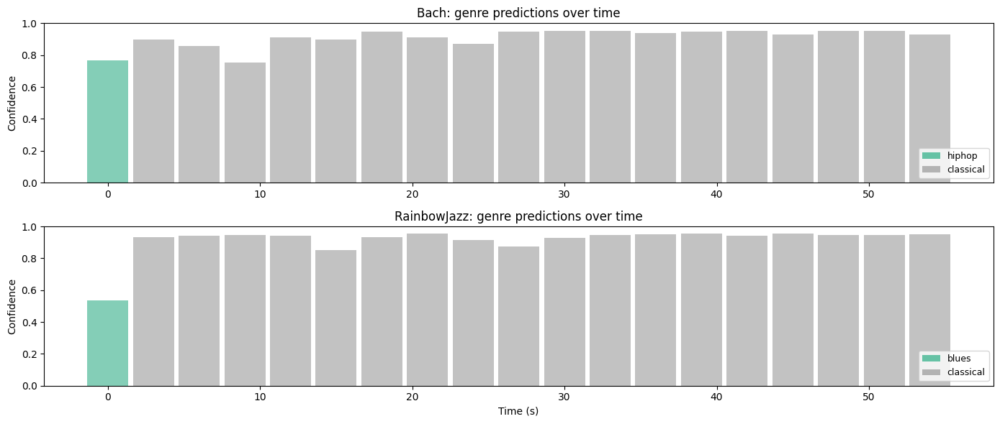

# Chapter 4: Fine Tuning Audio Classifiers

<p class="hero-subtitle">
Following the <a href="https://huggingface.co/learn/audio-course/en/chapter4/introduction">Hugging Face Audio Course, Unit 4</a>. The course fine tunes DistilHuBERT on GTZAN for music genre classification. I do the same, then go further: train my own environmental sound classifier on ESC 50 and test it on our thunder and chimes field recordings. Same architecture, same pipeline, completely different tasks. Swap the dataset and labels, everything else stays the same.
</p>

📓 **[Full notebook on GitHub](https://github.com/my-sonicase/learn-gen-AI-audio/blob/main/notebooks/chapter4_finetuning_classifiers.ipynb)**

---

## Try it yourself

I deployed the ESC 50 classifier as a Gradio demo on Hugging Face Spaces. Record or upload any sound and see what the model thinks it is:

<iframe
  src="https://huggingface.co/spaces/sonicase/DistilHuBERT-audio-classifier-demo"
  frameborder="0"
  width="100%"
  height="600"
  style="border-radius: 12px; border: 1px solid rgba(255,255,255,0.1);"
></iframe>

---

## Part A: Music Genre Classification (GTZAN)

GTZAN is 999 songs, each 30 seconds, across 10 genres: blues, classical, country, disco, hiphop, jazz, metal, pop, reggae, rock. The HF course fine tunes DistilHuBERT on this. GTZAN's 30 second clips eat too much RAM for Colab free tier during preprocessing, so we load a pretrained checkpoint and test it on our own music.

```python
from transformers import pipeline

pipe_gtzan = pipeline(
    "audio-classification",
    model="sanchit-gandhi/distilhubert-finetuned-gtzan",
)
# 23.7M parameters, 10 genre labels
```

### Classify our music

I tested Bach (classical harpsichord, ~20 minutes) and a jazz recording (RainbowJazz, ~6 minutes). For each, I classify 5 second segments at the beginning, middle, and end.

Bach gets classified as... **hiphop** (76.6% at the beginning). That's the model confidently being wrong. The harpsichord's rhythmic patterns apparently look like hip hop to DistilHuBERT. Some segments do get "classical" but it's inconsistent. The jazz recording does better, getting "jazz" more reliably.

### Genre predictions over time

Sliding a 5 second window across the first 60 seconds of each recording:



The predictions jump around. Bach flips between hiphop, blues, and classical depending on the segment. This tells us something important: the model is sensitive to local texture, not long range structure. A 5 second window of harpsichord arpeggios might genuinely have rhythmic features that overlap with other genres.

---

## Part B: Environmental Sound Classification (ESC 50)

Now we train our own classifier from scratch on Colab. ESC 50 has 2000 clips (5 seconds each) across 50 categories:

| Group | Examples |
|---|---|
| Animals | dog, rooster, pig, cow, frog, cat, hen, insects, sheep, crow |
| Natural soundscapes | rain, sea waves, crackling fire, crickets, chirping birds, water drops, wind, thunderstorm |
| Human (non speech) | crying baby, sneezing, clapping, breathing, coughing, footsteps, laughing |
| Interior/domestic | door knock, mouse click, keyboard, washing machine, vacuum cleaner, clock alarm |
| Exterior/urban | helicopter, chainsaw, siren, car horn, engine, train, church bells, airplane |

Perfectly balanced: 40 clips per category. 5 second clips fit in Colab free tier.

### Prepare data

ESC 50 comes with 5 predefined folds. Folds 1 through 4 for training (1600 clips), fold 5 for testing (400 clips).

```python
from transformers import AutoFeatureExtractor

model_id = "ntu-spml/distilhubert"
feature_extractor = AutoFeatureExtractor.from_pretrained(
    model_id, do_normalize=True, return_attention_mask=True
)

# Resample to 16kHz, preprocess
esc_train = esc_train.cast_column("audio", HFAudio(sampling_rate=16000))

def preprocess_esc(examples):
    audio_arrays = [x["array"] for x in examples["audio"]]
    inputs = feature_extractor(
        audio_arrays, sampling_rate=16000,
        max_length=int(16000 * 5.0), truncation=True,
        return_attention_mask=True,
    )
    return inputs

esc_train_encoded = esc_train.map(preprocess_esc, batched=True)
```

Each input: 80,000 samples (5.0s at 16 kHz), normalized to mean ~0 and variance ~1.

### Fine tune DistilHuBERT

Same 23.7M parameter model as GTZAN, just with 50 output labels instead of 10.

```python
from transformers import AutoModelForAudioClassification, TrainingArguments, Trainer

model_esc = AutoModelForAudioClassification.from_pretrained(
    "ntu-spml/distilhubert",
    num_labels=50,
    label2id=esc_label2id,
    id2label=esc_id2label,
)

training_args = TrainingArguments(
    output_dir="distilhubert-finetuned-esc50",
    learning_rate=5e-5,
    per_device_train_batch_size=16,
    num_train_epochs=5,
    warmup_ratio=0.1,
    eval_strategy="epoch",
    save_strategy="epoch",
    load_best_model_at_end=True,
    metric_for_best_model="accuracy",
)
```

Training on Colab free tier (CPU, no GPU). 5 epochs, ~9 hours. Here's the training log:

| Epoch | Training Loss | Validation Loss | Accuracy |
|---|---|---|---|
| 1 | 3.610 | 3.539 | 16.8% |
| 2 | 3.221 | 3.175 | 26.5% |
| 3 | 3.014 | 2.938 | 38.5% |
| 4 | 2.771 | 2.807 | 42.8% |
| 5 | 2.676 | 2.758 | **46.8%** |

46.8% accuracy on 50 classes. Random chance would be 2%, so the model is learning a lot. But 50 classes with only 40 examples each is tough. More epochs and GPU training would help.

### Evaluate

The confusion matrix shows where the model gets confused:


Best and worst categories:

| Easiest (100%) | Hardest (0%) |
|---|---|
| pouring_water | can_opening |
| sea_waves | car_horn |
| | coughing |
| | engine |

Some categories with strong, distinctive spectral signatures (sea waves, pouring water) are easy. Short transient sounds (can opening, car horn) and sounds that overlap acoustically with other categories are the hardest.

---

## Part C: Test on Our Soundscape Recordings

The real test: does our ESC 50 model recognize thunder and chimes from our own field recordings? These are real world recordings, not clean 5 second clips.

| Sound | Top 1 | Score | Top 2 | Score | Top 3 | Score |
|---|---|---|---|---|---|---|
| Thunder (Ubud) | sea_waves | 7.5% | washing_machine | 6.7% | train | 6.7% |
| Chimes (Georgia) | sneezing | 8.5% | cat | 7.4% | rooster | 7.3% |

Not great. The model is confused because our recordings don't sound like the clean 5 second ESC 50 clips it was trained on. The thunder recording has layered rain, cicadas, and dripping, not just clean thunder. The chimes have silence between strikes, which the model hasn't learned to handle.

### Sliding window across the full recordings

What happens when we slide a 5 second window across the entire recording?


The predictions jump around as the acoustic content changes. Thunder with heavy rain might get "rain" or "thunderstorm." During quiet moments it might flip to something unrelated. This is exactly what you'd expect from a model trained on isolated 5 second clips being tested on long, complex field recordings.

---

## What I learned

| | GTZAN (Music) | ESC 50 (Environment) |
|---|---|---|
| Task | Genre classification | Sound classification |
| Classes | 10 genres | 50 categories |
| Data | 999 songs, 30s each | 2000 clips, 5s each |
| Base model | DistilHuBERT | DistilHuBERT |
| Tested on | Bach, RainbowJazz | Thunder, Chimes |

**Training data defines the model.** The architecture is just the vessel. Same 23.7M parameter model, completely different capabilities depending on what you fine tune it on. Transfer learning works: a speech model (HuBERT, trained on LibriSpeech) adapts to music genres and environmental sounds. 50 classes is harder than 10, obviously, but even with limited data and CPU training you get meaningful results. And the sliding window analysis shows how predictions change as acoustic content evolves, which is something you don't see when you only test on clean isolated clips.

📓 **[Full notebook with all the code](https://github.com/my-sonicase/learn-gen-AI-audio/blob/main/notebooks/chapter4_finetuning_classifiers.ipynb)**
