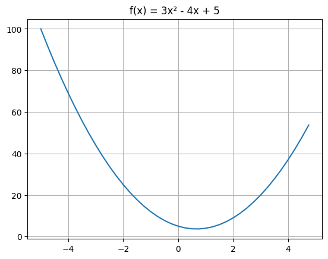
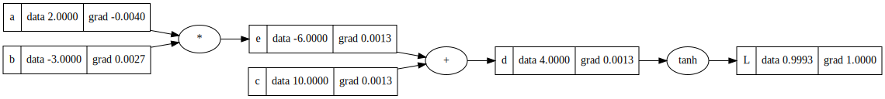
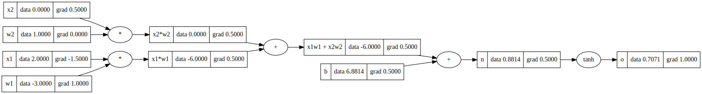
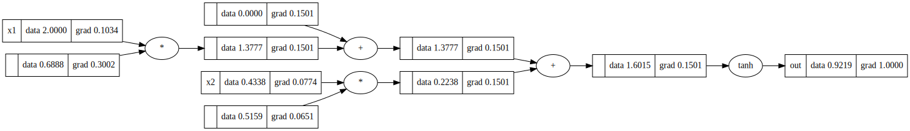
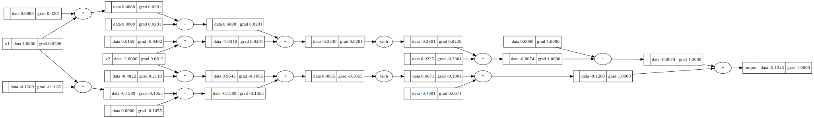
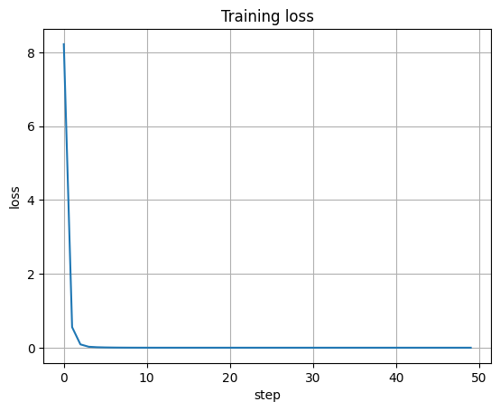
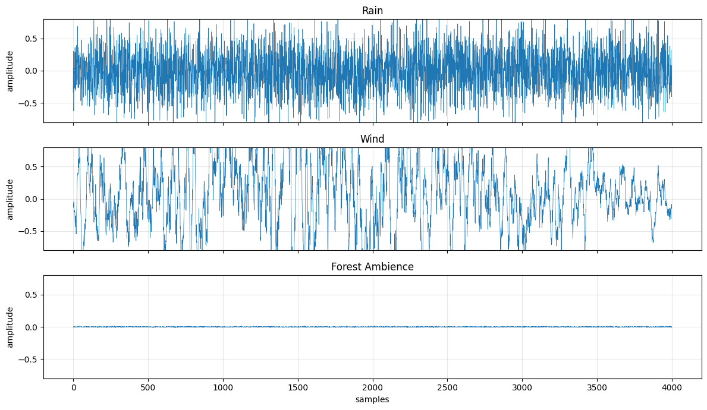
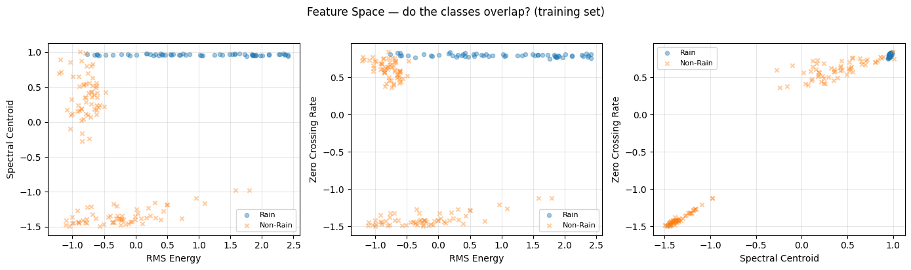
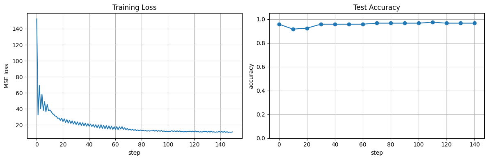
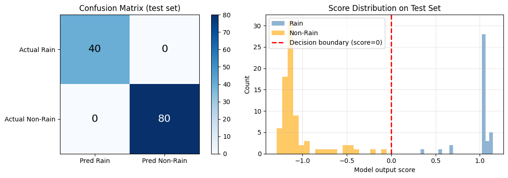

# Lecture 1: Micrograd — Backpropagation from Scratch

<p class="hero-subtitle">
Following <a href="https://www.youtube.com/watch?v=VMj-3S1tku0">Karpathy's Neural Networks: Zero to Hero, Lecture 1</a>. We build <code>micrograd</code>, a tiny scalar valued autograd engine, then a neural net library on top of it. Every operation builds a computation graph. Call <code>.backward()</code> and gradients flow from the loss all the way back to the inputs via the chain rule. Then we apply it to audio: classify synthetic soundscapes using hand crafted features.
</p>

📓 **[Full notebook on GitHub](https://github.com/my-sonicase/learn-gen-AI-audio/blob/main/notebooks/karpathy_lecture1_micrograd_audio.ipynb)**

---

## What is a derivative?

Before building anything, the intuition has to be rock solid. A derivative tells you: if I nudge the input by a tiny `h`, how much does the output change?

```python
def f(x):
    return 3*x**2 - 4*x + 5

x = 3.0
h = 0.001
numerical_grad = (f(x + h) - f(x)) / h  # → 14.003
# analytical: f'(x) = 6x - 4 → at x=3 → 14.0
```



The numerical derivative (14.003) matches the analytical one (14.0). The tiny residual is just because `h` isn't infinitely small. Same idea extends to functions of multiple inputs: nudge each input independently, measure how the output changes. That's the partial derivative.

```python
a = 2.0; b = -3.0; c = 10.0
d = a*b + c  # = 4.0

# dd/da = -3.0 (= b), dd/db = 2.0 (= a), dd/dc = 1.0
```

---

## The Value class: building the autograd engine

We wrap every scalar in a `Value` object that stores the data, remembers its children in the compute graph, stores the gradient (initialized to 0), and holds a `_backward` function that knows how to propagate gradients through that specific operation.

```python
class Value:
    def __init__(self, data, _children=(), _op='', label=''):
        self.data = data
        self.grad = 0.0
        self._backward = lambda: None
        self._prev = set(_children)
        self._op = _op
        self.label = label
```

Every time you do `a * b` or `a + b`, a new `Value` is created that remembers `a` and `b` as its children and stores the appropriate `_backward` function. Addition propagates gradients equally to both inputs. Multiplication swaps: `da = grad * b.data`, `db = grad * a.data`. Tanh applies the chain rule: `d_input = grad * (1 - output**2)`.

The key method is `backward()`, which does a topological sort of the entire graph and then calls each node's `_backward` in reverse order. That's it. That's backpropagation.

```python
a = Value(2.0, label='a')
b = Value(-3.0, label='b')
c = Value(10.0, label='c')

e = a * b       # -6.0
d = e + c       # 4.0
L = d.tanh()    # 0.9993

L.backward()
# a.grad = -0.0040, b.grad = 0.0027, c.grad = 0.0013
```



---

## Manual backprop: a single neuron

A neuron is: `output = tanh(w1*x1 + w2*x2 + b)`. Inputs, weights, bias, activation. That's the mathematical model of a synapse.

```python
x1 = Value(2.0);  w1 = Value(-3.0)
x2 = Value(0.0);  w2 = Value(1.0)
b  = Value(6.881)  # chosen to make output ≈ 0.707

n = x1*w1 + x2*w2 + b
o = n.tanh()   # 0.7071

o.backward()
# w1.grad = 1.0, w2.grad = 0.0 (x2 is 0, so w2 has no effect)
# x1.grad = -1.5, x2.grad = 0.5
```



Cross check with PyTorch: exact same gradients. Our engine works.

---

## The neural net library

On top of `Value` we build three classes: `Neuron` (list of weights + bias, applies tanh), `Layer` (list of neurons), `MLP` (list of layers). Each class has a `parameters()` method that collects all weights and biases for gradient descent.

```python
class Neuron(Module):
    def __init__(self, nin, nonlin=True):
        self.w = [Value(random.uniform(-1, 1)) for _ in range(nin)]
        self.b = Value(0)

    def __call__(self, x):
        act = sum((wi * xi for wi, xi in zip(self.w, x)), self.b)
        return act.tanh() if self.nonlin else act
```

A single neuron with 2 inputs, visualized:



A full MLP(2, [2, 1]), all the way from inputs to output:



---

## Training on a toy dataset

4 examples, 3 inputs each, targets are +1 or -1. MLP(3, [4, 4, 1]) with 41 parameters. The training loop is dead simple: forward pass, compute MSE loss, backward, gradient descent.

```python
for step in range(50):
    ypred = [model(x) for x in xs]
    loss = sum([(yout - ygt)**2 for ygt, yout in zip(ys, ypred)])
    model.zero_grad()
    loss.backward()
    for p in model.parameters():
        p.data -= 0.05 * p.grad
```

| Step | Loss | Predictions |
|---|---|---|
| 0 | 8.219 | [-0.64, 0.24, 0.25, -0.55] |
| 10 | 0.000 | [1.0, -1.01, -0.98, 1.0] |
| 20 | 0.000 | [1.0, -1.0, -1.0, 1.0] |

Converges in about 10 steps. The predictions snap to the targets.



---

## 🎧 Audio Application: Soundscape Classifier

Now the fun part. We apply our micrograd MLP to classify audio. Three synthetic soundscape classes: rain, wind, and forest ambience. For each clip we extract three hand crafted features: RMS energy (loudness), spectral centroid (brightness), and zero crossing rate (noisiness). Then we train our MLP to classify them.

### The sounds

**🌧️ Rain** — broadband white noise at variable intensity. Key feature: high zero crossing rate (~0.5) and flat spectrum.
<audio controls>
  <source src="audio/rain.mp3" type="audio/mpeg">
</audio>

**💨 Wind** — amplitude modulated low pass noise. Key feature: very low ZCR (slow oscillations), low spectral centroid.
<audio controls>
  <source src="audio/wind.mp3" type="audio/mpeg">
</audio>

**🌲 Forest Ambience** — sparse chirps on a quiet background. Key feature: low RMS (mostly silence), high ZCR during chirps.
<audio controls>
  <source src="audio/forest.mp3" type="audio/mpeg">
</audio>

### Spectral profiles



The spectrograms show the differences clearly. Rain has energy spread across all frequencies. Wind is concentrated in the low end. Forest has sparse bursts of high frequency energy (the chirps) on a quiet background.

### Feature extraction

```python
def extract_features(signal):
    return [
        rms_energy(signal),         # loudness
        spectral_centroid(signal),   # brightness (normalized 0 to 1)
        zero_crossing_rate(signal),  # noisiness
    ]

# Rain:   rms=0.186  centroid=0.501  zcr=0.497
# Wind:   rms=0.057  centroid=0.150  zcr=0.028
# Forest: rms=0.060  centroid=0.400  zcr=0.455
```

Rain has high RMS and high ZCR. Wind has low everything. Forest has low RMS but high ZCR (the chirps push the zero crossings up). These features separate the classes, but not perfectly: a light rain and a strong wind gust can have similar RMS.

### The dataset

Binary classification: rain (+1) vs non rain (-1). 180 training samples (60 per class), 120 test samples (40 per class). Variable amplitude per sample so the distributions overlap and the problem is actually hard.



### Training

MLP(3, [8, 8, 1]) with 89 parameters. Same training loop as before, but with gradient clipping (cap gradients at ±5) to keep things stable.



### Results

| | Predicted Rain | Predicted Non Rain |
|---|---|---|
| Actual Rain | TP = 40 | FN = 0 |
| Actual Non Rain | FP = 0 | TN = 80 |

100% accuracy, precision, recall, and F1 on the test set. The features separate the classes well enough that even our tiny micrograd MLP nails it.



The score distribution shows well separated peaks for rain (positive scores) and non rain (negative scores). No overlap near the decision boundary at 0. Clean separation.

---

## What I learned

Every neural net is a mathematical expression. Forward pass evaluates it. Backward pass differentiates it. The chain rule is the entire trick. `loss.backward()` works because we built a topological sort of the graph and call `_backward()` in reverse order. Gradient descent is one line: `param.data -= lr * param.grad`.

For audio: the same backprop we built from scratch works on audio features exactly the same way as on any other data. RMS, spectral centroid, and zero crossing rate are the "old school" version of learned embeddings. Understanding them gives you intuition for what neural nets later learn automatically from raw audio. Later in the course (the WaveNet lecture) we'll see how to skip hand crafted features entirely and let the network learn its own representations.

📓 **[Full notebook with all the code](https://github.com/my-sonicase/learn-gen-AI-audio/blob/main/notebooks/karpathy_lecture1_micrograd_audio.ipynb)**
