# Building Audio Flamingo 3 from Scratch

<p class="hero-subtitle">
<a href="https://arxiv.org/abs/2502.02026">Audio Flamingo 3</a> (NeurIPS 2025 Spotlight, NVIDIA) is an audio language model that listens to audio and answers questions about it. I rebuilt it from scratch in 6 modules, ~850 lines of pure PyTorch, all running on CPU. No pretrained weights, no HuggingFace. Every component is the real thing, just smaller. Here's what I learned.
</p>

📓 **Notebooks on GitHub:**
[Module 1](https://github.com/my-sonicase/learn-gen-AI-audio/blob/main/notebooks/module1_audio_stack.ipynb) ·
[Module 2](https://github.com/my-sonicase/learn-gen-AI-audio/blob/main/notebooks/module2_afwhisper_encoder.ipynb) ·
[Module 3](https://github.com/my-sonicase/learn-gen-AI-audio/blob/main/notebooks/module3_clap.ipynb) ·
[Module 4](https://github.com/my-sonicase/learn-gen-AI-audio/blob/main/notebooks/module4_llava_pattern.ipynb) ·
[Module 5](https://github.com/my-sonicase/learn-gen-AI-audio/blob/main/notebooks/module5_training.ipynb) ·
[Module 6](https://github.com/my-sonicase/learn-gen-AI-audio/blob/main/notebooks/module6_af3_extras.ipynb)


---

## Try it

Before diving into the code, try the real AF3 model. Upload any audio and ask a question about it:

<iframe
  src="https://huggingface.co/spaces/sonicase/audio-flamingo-3"
  frameborder="0"
  width="100%"
  height="700"
  style="border-radius: 12px; border: 1px solid rgba(255,255,255,0.1);"
></iframe>

---

## What is Audio Flamingo 3?

AF3 takes audio (up to 10 minutes) and a text question, and generates a text answer. "What instrument is playing?" → "A piano, playing a melody in C major." It's built on three components: an audio encoder (AF Whisper, 637M params), a small projector MLP (~4M params), and a frozen LLM (Qwen 2.5 7B). The idea comes from LLaVA (vision language models): take a powerful pretrained encoder, project its outputs into the LLM's embedding space, and let the LLM reason about them.

The architecture:

```
Raw audio → Log Mel Spectrogram → AF-Whisper Encoder → Audio Projector → LLM → Text answer
            (Module 1)            (Module 2)           (Module 4)       (Module 4)
```

---

## Module 1: The Audio Stack

Before touching any neural network, you need to understand what the model actually sees. AF3 doesn't see waveforms. It sees log mel spectrograms: 2D images of sound where one axis is time, the other is frequency (on a perceptual scale), and color is energy.

I built the entire pipeline from scratch. No librosa, no torchaudio. Just numpy.

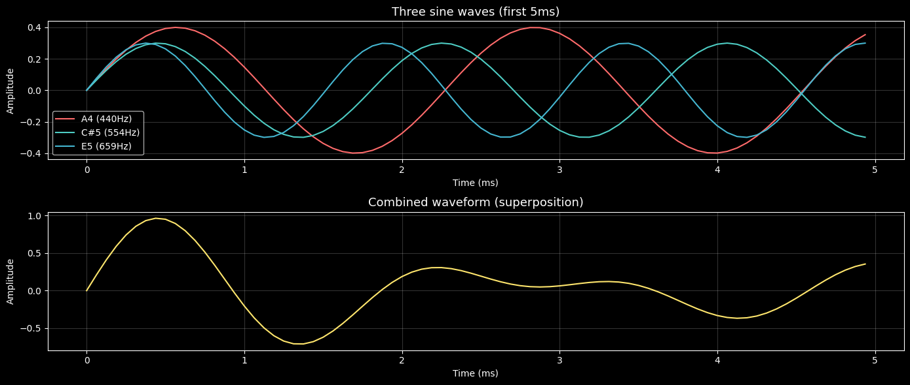

A chord made of three sine waves (A4, C#5, E5). The raw waveform is a mess of overlapping oscillations. You can't tell what frequencies are present just by looking at it.

The Fourier Transform decomposes the signal into its frequency components. Three sharp peaks, exactly at 440 Hz, 554 Hz, and 659 Hz.

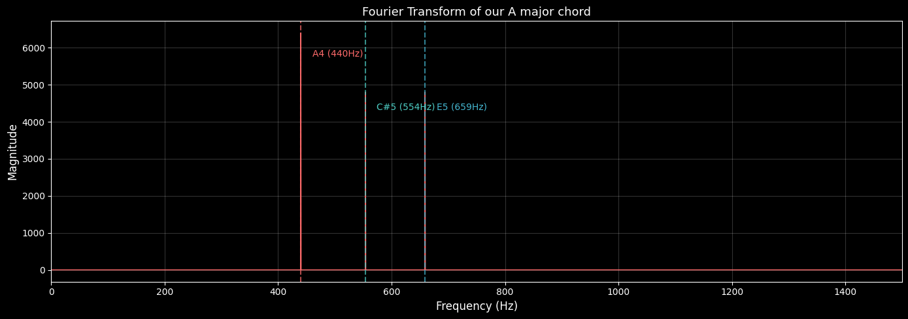

But the FFT gives you frequencies over the entire clip. Sound changes over time. The STFT (Short Time Fourier Transform) slides a window over the waveform and computes the FFT inside each window, giving you frequency content as a function of time.

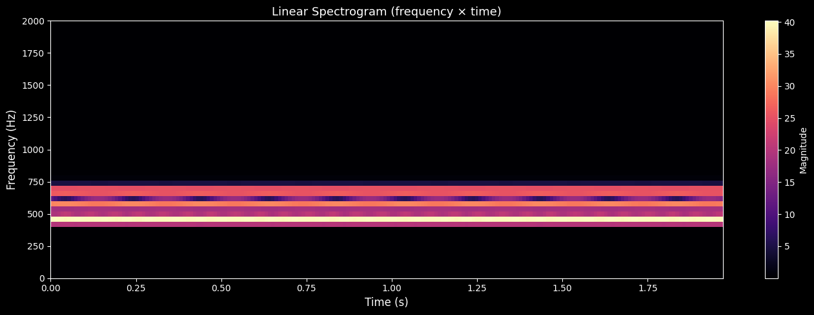

The problem: the frequency axis is linear, but human hearing is logarithmic. We're much more sensitive to differences between 100 Hz and 200 Hz than between 7000 Hz and 7100 Hz. The mel scale fixes this by compressing high frequencies and expanding low ones.

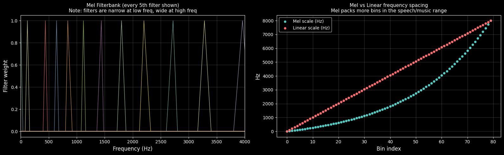

Finally, we apply a log transform (matching perceived loudness) and normalize. The result is the log mel spectrogram: an (80, T) tensor that is exactly what Whisper (and AF3) sees.

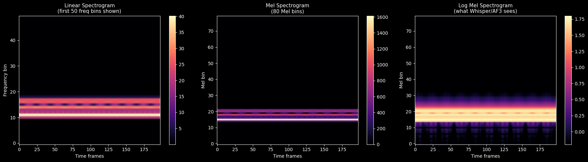

---

## Module 2: AF Whisper Encoder

The encoder takes the (80, 3000) log mel spectrogram and produces 1500 vectors of dimension 1280. These are the "audio tokens" that the LLM will reason about.

The architecture: two convolutional layers (the "stem") that extract local features and downsample by 2x, then positional embeddings, then 32 transformer blocks with multi head self attention and feed forward networks.

I built each piece from scratch: the conv stem, sinusoidal positional embeddings, multi head self attention, the feed forward network with GELU activation, and the full encoder. About 150 lines of pure PyTorch.

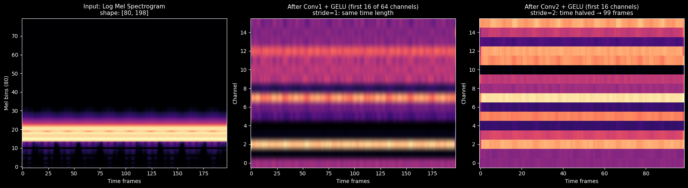

The conv stem does three things at once: local feature extraction (nearby frames are correlated), temporal downsampling (3000 frames → 1500, halving the compute for the LLM), and channel expansion (80 mel bins → 1280 dimensions).

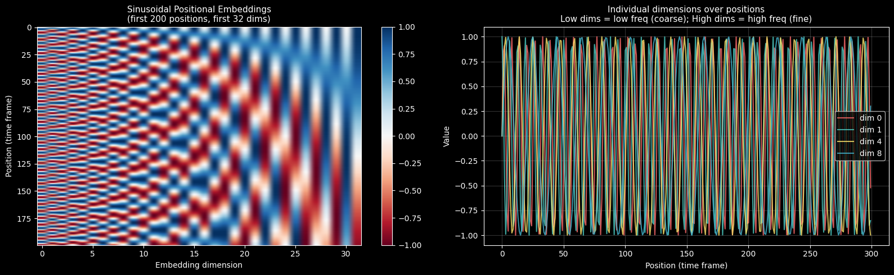

Positional embeddings give the transformer a sense of time. Without them, self attention is permutation invariant: shuffle the frames and you get the same output. That's catastrophic for audio where timing is everything.

The key difference between AF Whisper and vanilla Whisper: same architecture, different training. AF Whisper is retrained on 50M audio text pairs from scratch, while vanilla Whisper was trained on speech transcription. Same weights structure, completely different learned representations.

---

## Module 3: CLAP (Contrastive Language Audio Pretraining)

Before connecting the encoder to the LLM, we need to understand how audio and language get aligned in the same embedding space. CLAP is the bridge.

The idea: train an audio encoder and a text encoder so that matching pairs (audio + its description) end up near each other in embedding space, and non matching pairs end up far apart. The loss function is InfoNCE: treat each row of the similarity matrix as a classification problem where the diagonal entry is the correct class.

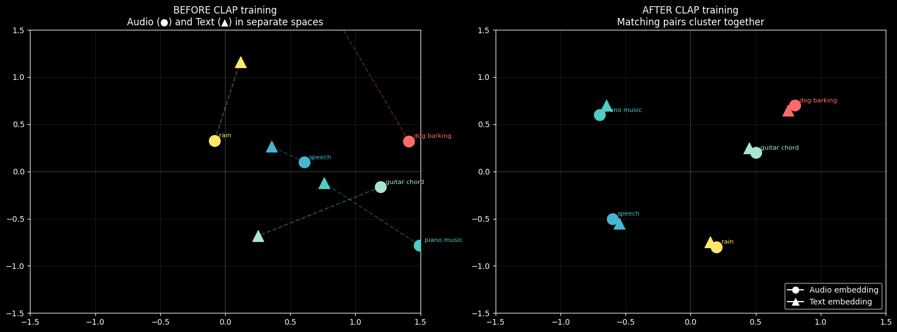

I built a nano CLAP with 5 synthetic audio concepts (dog barking, rain, siren, bird chirping, low rumble), trained it with contrastive learning, and watched the embedding space organize itself.

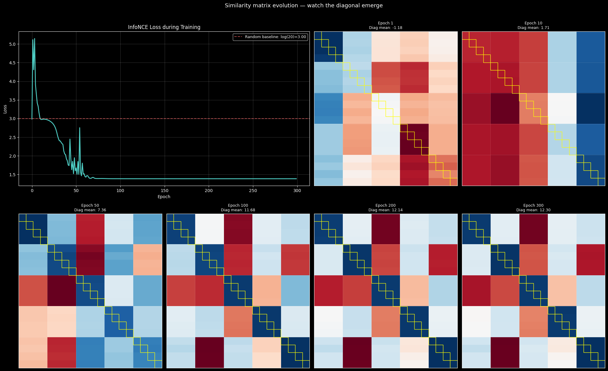

Before training, audio and text points are scattered randomly. After training, matching pairs cluster together. The similarity matrix's diagonal emerges clearly: matching pairs score high, everything else scores low.

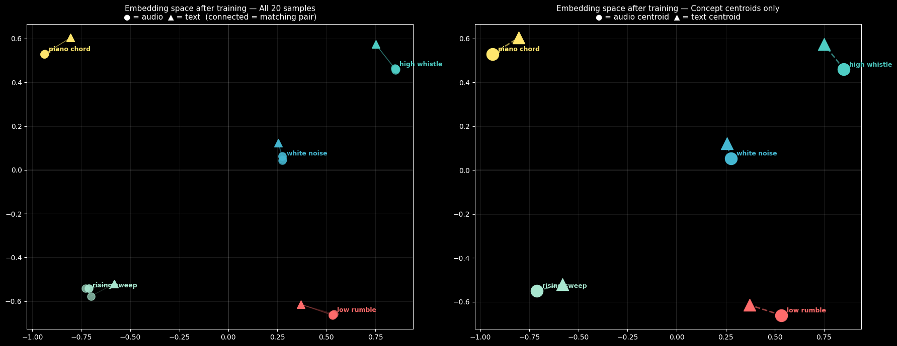

The payoff: zero shot audio classification. Drop in any audio clip, compute its similarity to text descriptions, and the nearest text is the classification. No classification head needed.

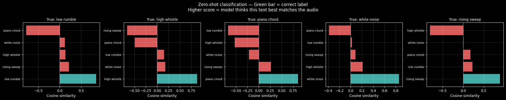

AF3 moved away from CLAP's global pooling to AF Whisper's per timestep embeddings. The reason: CLAP squashes all temporal information into one vector. AF Whisper preserves it as 1500 separate vectors, giving the LLM access to the full temporal structure.

---

## Module 4: The LLaVA Pattern

This is where everything comes together. The audio encoder produces (1500, 1280) embeddings. The LLM (Qwen 2.5 7B) expects input of dimension 3584. How do you bridge that gap?

A 2 layer MLP projector. That's it. Applied independently to each of the 1500 time steps. This is the "adapter" or "connector" that translates from the audio world to the language world.

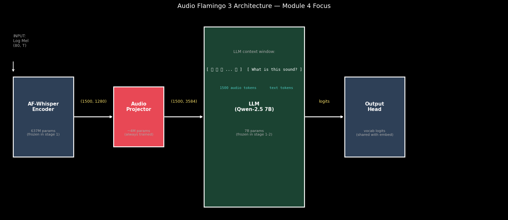

Inside the LLM, audio tokens and text tokens are indistinguishable. They're both just vectors of the same dimension. The sequence looks like:

```
[<audio> 🔊🔊🔊...🔊 </audio> "What is this sound?"]
 special  1500 audio tokens      text tokens
 token    (from projector)       (from vocab table)
```

The LLM then autoregressively generates the answer, attending to all previous tokens, both audio and text.

### The 5 stage training curriculum

AF3 doesn't train everything at once. It uses a 5 stage curriculum where each stage unfreezes more parameters and uses harder tasks. This is crucial for stability: if you train everything from random init simultaneously, the gradients from the LLM destroy the pretrained audio encoder.

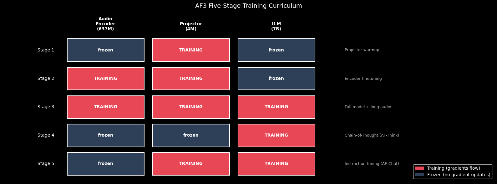

Stage 1: projector only (encoder and LLM frozen). Stage 2: encoder + projector. Stage 3: everything. Stages 4 and 5: harder tasks (reasoning, chat).

---

## Module 5: Training NanoAF3

I built a complete training pipeline with 6 sound categories, 3 question types per category, and 8 augmentations per sample (144 training pairs total). The model goes from random noise to coherent audio descriptions in about 2 minutes on CPU.

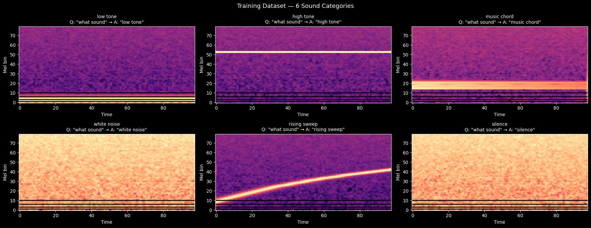

The training follows the curriculum: Stage 1 warms up the projector (50 epochs), then Stage 2 unfreezes the encoder (150 epochs). Before training, the model outputs random characters. After training, it correctly identifies sound types and answers questions about them.

The projector warmup is the keystone insight. Stage 1 exists because a randomly initialized projector feeds garbage to the LLM. You warm it up first so that by the time Stage 2 starts, the audio to language bridge is already functional.

---

## Module 6: What AF3 Adds

Three things separate AF3 from a basic "encoder + LLM" demo.

### Sliding window for long audio

AF Whisper processes 30 second chunks. A 10 minute recording = 20 chunks = 30,000 audio tokens. That doesn't fit in any context window. AF3's solution: pool each chunk into a summary vector, then let the summaries attend to each other via cross chunk attention. You lose fine temporal detail within a chunk but keep the global structure.

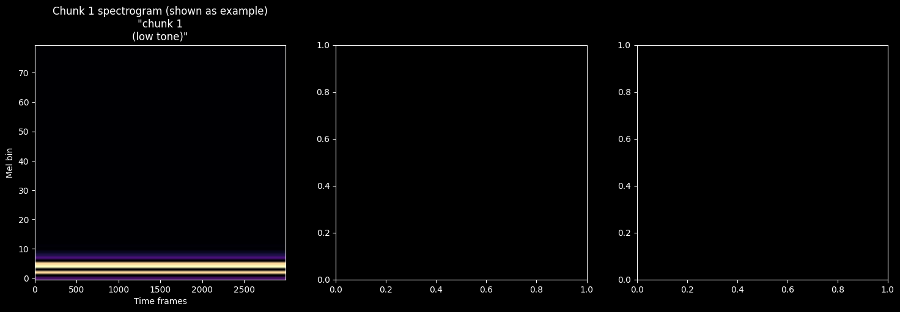

### AF Think: chain of thought reasoning

Some audio questions require multi step reasoning. "Is the tempo faster or slower than 120 BPM?" needs tempo estimation then comparison. AF3 uses structured reasoning: `<think> step by step reasoning </think> Answer: final answer`. The model learns to generate reasoning when the question is hard and skip it when it's easy. This is "on demand CoT."

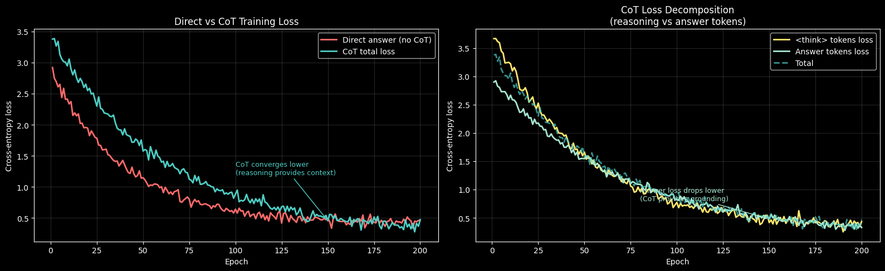

### AF Chat: multi turn dialogue

Real users have conversations. The audio appears only in the first turn. For subsequent turns, audio tokens stay in the context window while text history grows. The model attends to the original audio tokens for every answer.

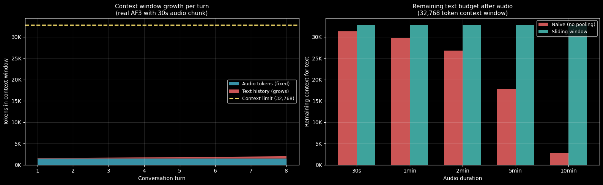

### The full picture

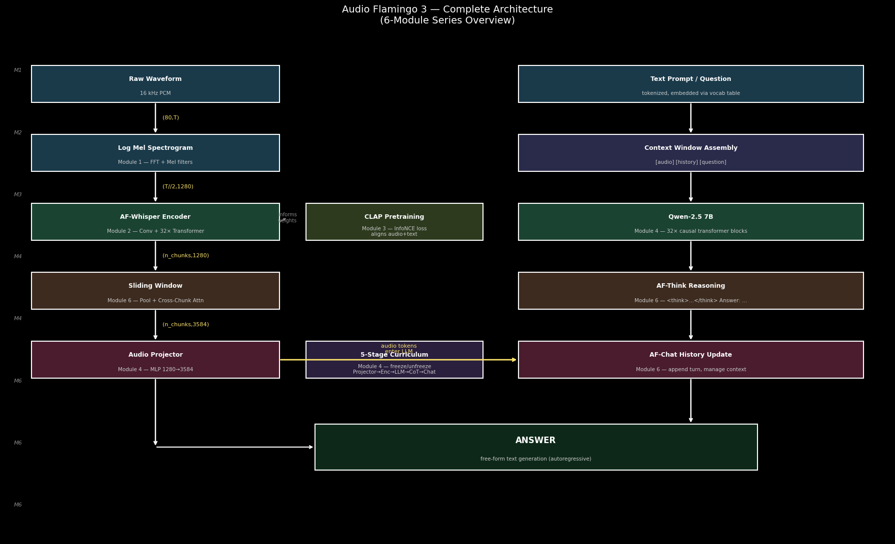

---

## What I learned

| Module | Topic | Key build | Lines |
|---|---|---|---|
| 1 | Log Mel Spectrogram | FFT → STFT → Mel → Log | ~50 |
| 2 | AF Whisper Encoder | ConvStem + PosEmb + Transformer | ~150 |
| 3 | CLAP | InfoNCE loss + zero shot classification | ~120 |
| 4 | LLaVA Pattern | Projector + NanoLLM + 5 stage curriculum | ~200 |
| 5 | Training | Dataset + Stage 1→2 loop + generation | ~180 |
| 6 | AF3 extras | Sliding window + CoT + Chat | ~150 |
| **Total** | | | **~850** |

The biggest insight: multimodal AI is simpler than it looks. You don't need a new architecture. You need a pretrained encoder (AF Whisper), a pretrained LLM (Qwen), and a small MLP projector between them. The curriculum (what to freeze, what to train, in what order) matters more than the architecture itself.

The projector is 0.05% of the total parameters but it's the single most important component to get right. Everything else is pretrained. The projector is the only thing that learns the audio to language translation from scratch.

📓 **Full notebooks:**
[Module 1](https://github.com/my-sonicase/learn-gen-AI-audio/blob/main/notebooks/module1_audio_stack.ipynb) ·
[Module 2](https://github.com/my-sonicase/learn-gen-AI-audio/blob/main/notebooks/module2_afwhisper_encoder.ipynb) ·
[Module 3](https://github.com/my-sonicase/learn-gen-AI-audio/blob/main/notebooks/module3_clap.ipynb) ·
[Module 4](https://github.com/my-sonicase/learn-gen-AI-audio/blob/main/notebooks/module4_llava_pattern.ipynb) ·
[Module 5](https://github.com/my-sonicase/learn-gen-AI-audio/blob/main/notebooks/module5_training.ipynb) ·
[Module 6](https://github.com/my-sonicase/learn-gen-AI-audio/blob/main/notebooks/module6_af3_extras.ipynb)
